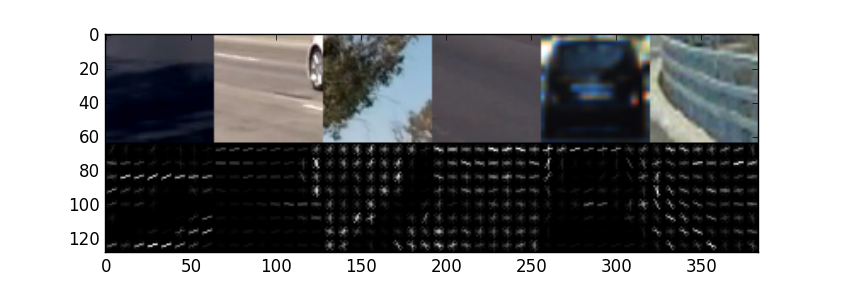
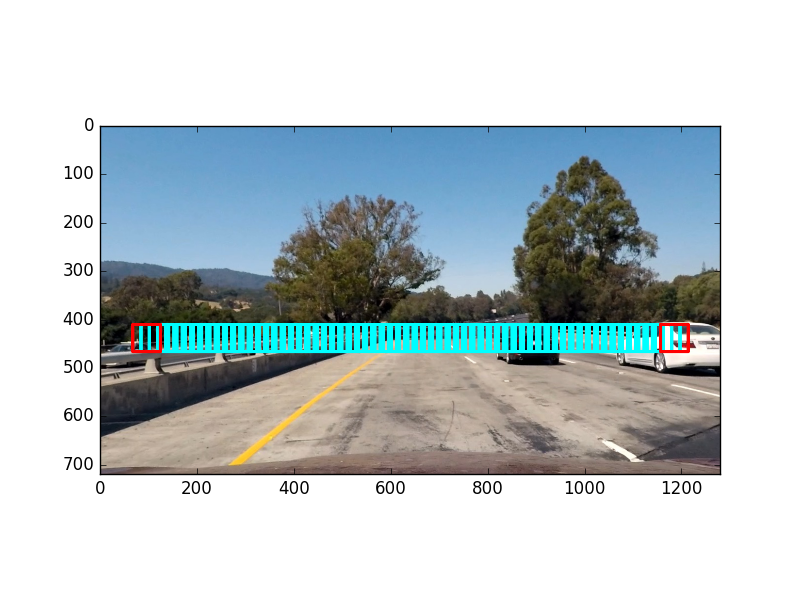
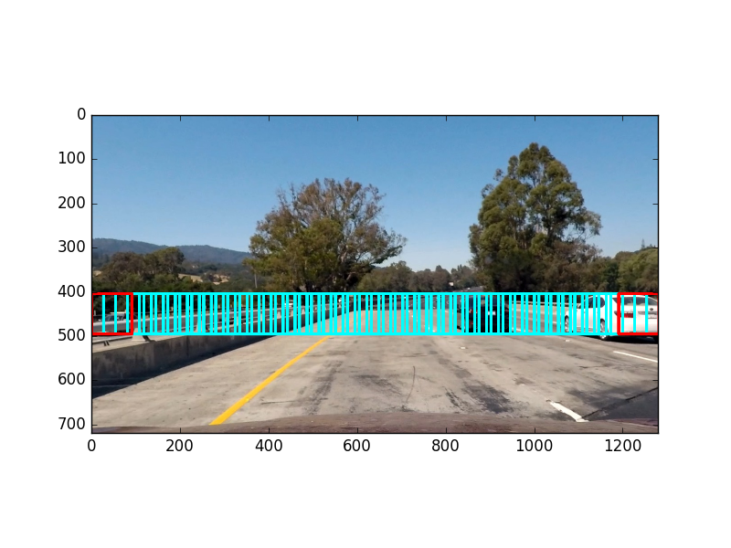
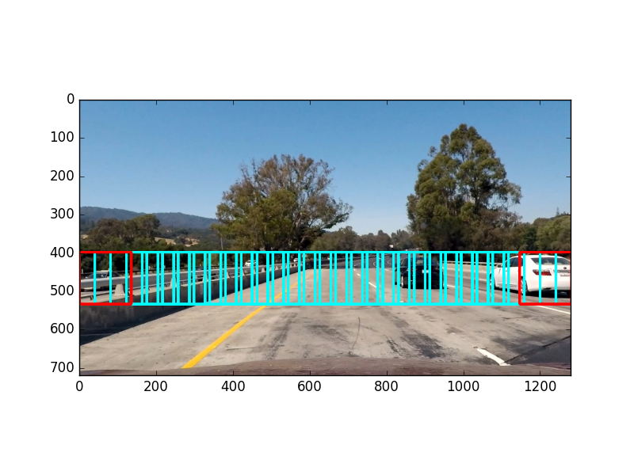
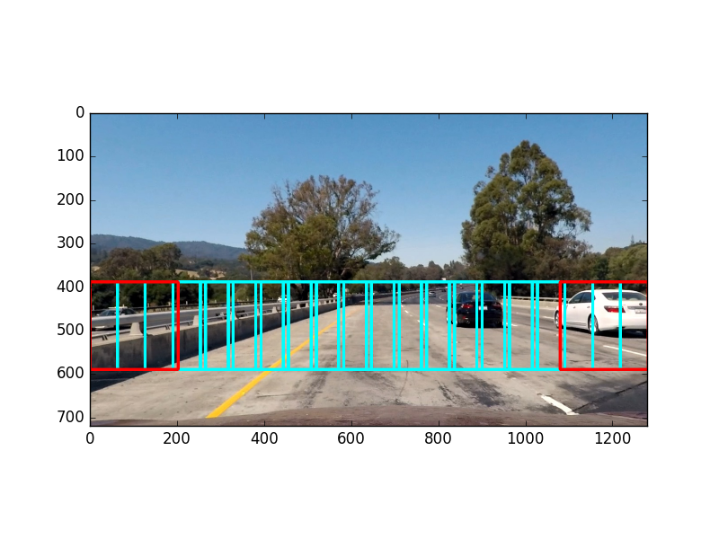
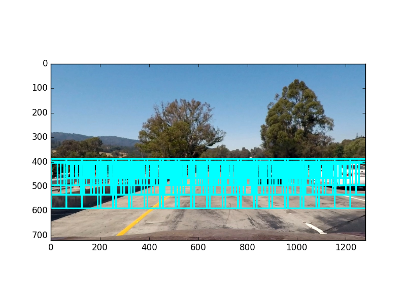
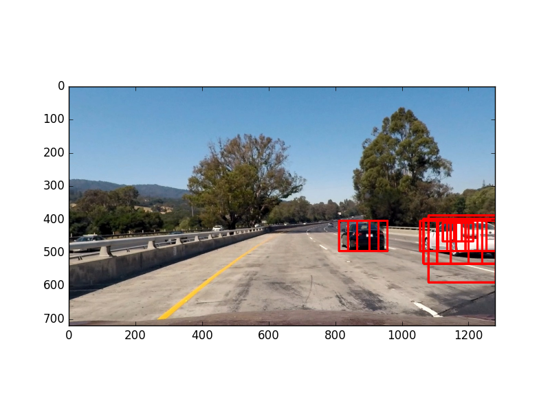
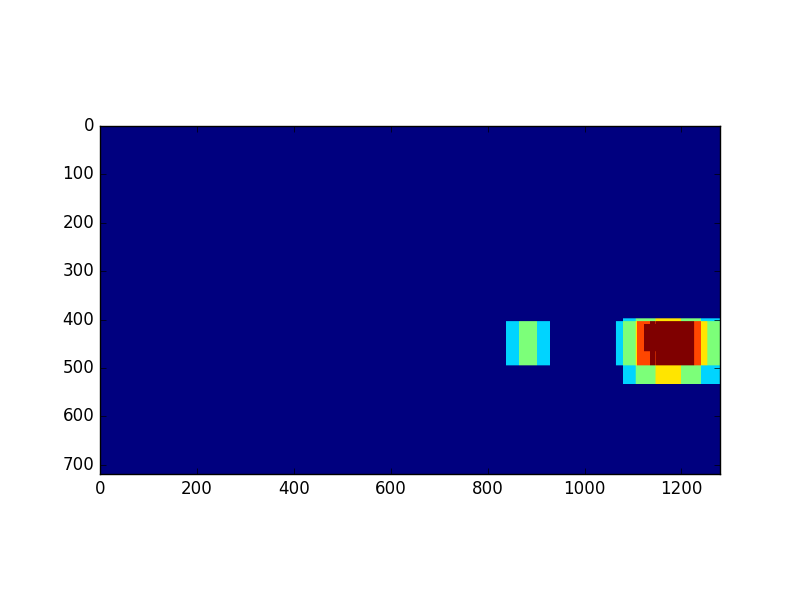
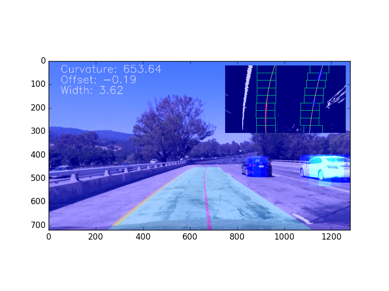
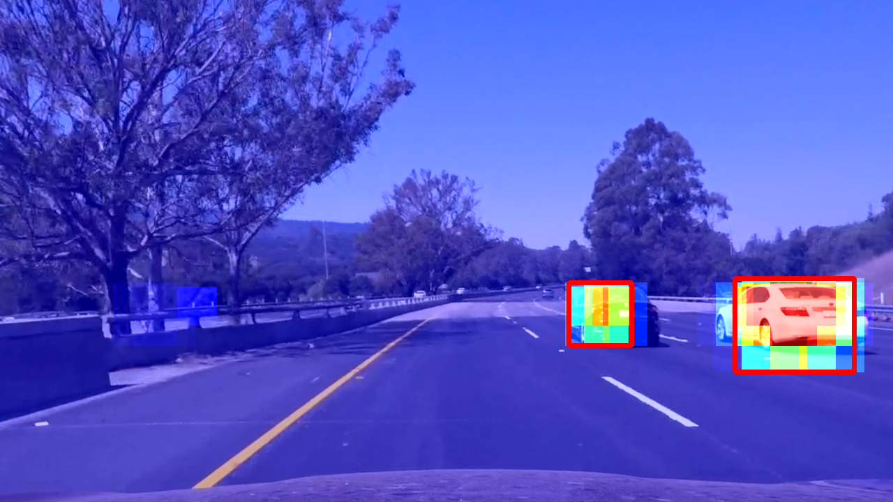

# Vehicle Detection Project

[](http://www.udacity.com/drive)

In this project, the goal is to write a software pipeline to detect vehicles in a video (started with the test_video.mp4 and later implement on full project_video.mp4).

## The Project

The goals / steps of this project are the following:

- Perform a Histogram of Oriented Gradients (HOG) feature extraction on a labeled training set of images and train a classifier Linear SVM classifier
- Optionally, you can also apply a color transform and append binned color features, as well as histograms of color, to your HOG feature vector.
- Note: for those first two steps don't forget to normalize your features and randomize a selection for training and testing.
- Implement a sliding-window technique and use your trained classifier to search for vehicles in images.
- Run your pipeline on a video stream (start with the test_video.mp4 and later implement on full project_video.mp4) and create a heat map of recurring detections frame by frame to reject outliers and follow detected vehicles.
- Estimate a bounding box for vehicles detected.

Here are links to the labeled data for [vehicle](https://s3.amazonaws.com/udacity-sdc/Vehicle_Tracking/vehicles.zip) and [non-vehicle](https://s3.amazonaws.com/udacity-sdc/Vehicle_Tracking/non-vehicles.zip) examples to train your classifier.
These example images come from a combination of the [GTI vehicle image database](http://www.gti.ssr.upm.es/data/Vehicle_database.html), the [KITTI vision benchmark suite](http://www.cvlibs.net/datasets/kitti/), and examples extracted from the project video itself.
You are welcome and encouraged to take advantage of the recently released [Udacity labeled dataset](https://github.com/udacity/self-driving-car/tree/master/annotations) to augment your training data.

Some example images for testing your pipeline on single frames are located in the `test_images` folder.
Examples of the output from each stage of the pipeline are saved in the folder called `output`.
The video called `project_video.mp4` is the video your pipeline should work well on.

The `challenge_video.mp4` video is an extra (and optional) challenge for you if you want to test your pipeline under somewhat trickier conditions.
The `harder_challenge.mp4` video is another optional challenge and is brutal!

**As an optional challenge** Once you have a working pipeline for vehicle detection, add in your lane-finding algorithm from the last project to do simultaneous lane-finding and vehicle detection!

**If you're feeling ambitious** (also totally optional though), don't stop there!
We encourage you to go out and take video of your own, and show us how you would implement this project on a new video!

## The rubric points are considered individually and described how each point is addressed in the implementation

### Histogram of Oriented Gradients (HOG)

The code for this step is contained in the functions `get_hog_features(img, vis=False, feature_vec=True)` and `extract_features(img)` in the file called `vehicle_classifier.py`).

The parameters for the classifier are contained in the class `VehicleClassifierTrainer` in the same file.

Different color spaces and different `skimage.hog()` parameters (`orientations`, `pixels_per_cell`, and `cells_per_block`) were explored.

I grabbed random images from each of the two classes and displayed them to get a feel for what the `skimage.hog()` output looks like.

Here is an example using the `YCrCb` color space and HOG parameters of `orientations=9`, `pixels_per_cell=(8, 8)` and `cells_per_block=(2, 2)`:



#### Final choice of HOG parameters

I tried various combinations of parameters and found that color histogram and color bins are not as relevant as the HOG features, but still improve the classifier.
So for the color features the values were reduced from `32` to `16` which improved the performance a bit, but the classifier could detect the vehicles with nearly the same accuracy.

The best color spaces where `LUV`, `YUV`, `YCrCb`.
They all resulted in the same accuracy for the classifier.
Finally `YCrCb` was used.

Changing the `cell_per_block` from `2` to `3` did not increase the accuracy, but took much longer to calculate, so this parameter was kept at `2`.

To increase the performance further, the value for `pix_per_cell` was increased from `8` to `16`, but this resulted in an accuracy reduction of 1-2%.
So this parameter was kept at `8`.

The HOG channels were tested with `0,1,2,GRAY,ALL` and `0,GRAY,ALL` resulted in a good accuracy.
This was tested with the colorspaces `LUV`, `YUV`, `YCrCb`.
Parameter value `ALL` results in a huge performance impact and `GRAY` is better but also increases the performance a bit, so the channels were set to `0`.

#### Train a classifier using the selected HOG features (and color features)

The training samples could not train the classifier to distict between cars and shadows, so some new training data was extracted from the `project_video.mp4` using the script `create_non_vehicle_data.py`.

To train the classifier you must execute the following command:

```bash
python train.py --input-cars vehicles/ --input-non-cars non-vehicles/ neg_augmentation_img/ -o vehicle_classifier.p
```

This is the output of the training script:

```output
Data summary
============
Total cars: 8792 non-cars: 10600
Train cars: 7065 non-cars: 8448
Test cars: 1727 non-cars: 2152
Reading images and extracting features...
Using the following parameters:
classify_img_size = (64, 64)
color_space = YCrCb
spatial_size = (16, 16)
hist_bins = 16
hist_range = (0, 256)
orient = 9
pix_per_cell = 8
cell_per_block = 2
hog_channels = 0
61.89 seconds to read images and extract features...
Feature length per item: 2580
Start training SVC...
10.1 seconds to train SVC...
Train Accuracy of SVC =  0.9999
Test Accuracy of SVC =  0.9732
Save classifier to: vehicle_classifier.p
```

### Sliding Window Search

#### Scales and overlap of windows

The scales and overlaps are defined in the function `get_windows(img)` in the file `vehicle_classifier.py`.
There are four different scales and an overlapping of `0.7` used:






resulting in:



#### Pipeline for searching vehicles

First the sliding windows are classified using the trained classifier.
The hot windows are shown in the following image:



### Video Implementation

Here's a [link to my video result](output/project_video_2018-06-11_16-56-57.mp4).

The following line creates the video linked above:

```bash
python main.py -i project_video.mp4 -vvo
```

or for the `test_video.mp4`:

```bash
python main.py -i test_video.mp4 -vvo
```

Where `-o` says the output should be saved into the `output`-folder and `-vv` sets the verbose level to `2` (showing some calculated road parameters, the top-down-view, the heatmap and the bounding boxes of the tracked vehicles).
The maximum verbose level is 5, and can be defined by `-vvvvv`.

#### Filter false positives and combine overlapping bounding boxes

To remove false positives and accumulate multiple detections, all hot windows of one frame are summed up into one heatmap and then thresholded:



To improve this step further, a second heatmap is used, which sums the heatmaps of multiple frames:

```python
multiple_frames_heatmap *= 0.7
multiple_frames_heatmap += heat
```

The result in shown in the following image:



Afterwards `scipy.ndimage.measurements.label()` is used to identify individual blobs in the heatmap.
Each blob is assumed to correspond to a vehicle.
Bounding boxes are constructed to cover the area of each blob detected.



### Discussion

#### Any problems / issues faced during implementation of this project

The biggest issue was that the shadows and road guard were detected as vehicles in almost all of the frames in the `test_video.mp4`.
Tuning the parameters of the feature extraction and the sliding windows did not result in a better classifier.
Even the test accuracy of the classifier was quite good, the large number of false positives could not be reduced in the `test_video.mp4` or the `project_video.mp4`.

To reduce this large amount of false positives a new dataset was created from images from the `project_video.mp4` within the folder `non-vehicles_project_video`.

This was the only step I found, to reduce the false positives.

#### Where will the pipeline likely fail? What could you do to make it more robust?

The pipeline is likely to fail if the camera is mounted in a different angle within the car.

The robustness of the pipeline can also be improved using a kalman filter or something similar, to track vehicle movements across multiple frames and further filter the positions of the cars.

Further improvements can be seen in similar projects such as YOLO or SSD.
Using those projects as the classifier would result in a much better tracking.

---

# Advanced Lane Finding Project

[](http://www.udacity.com/drive)

In this project, the goal is to write a software pipeline to identify the lane boundaries in a video.

## The Project

The goals / steps of this project are the following:

- Compute the camera calibration matrix and distortion coefficients given a set of chessboard images.
- Apply a distortion correction to raw images.
- Use color transforms, gradients, etc., to create a thresholded binary image.
- Apply a perspective transform to rectify binary image ("birds-eye view").
- Detect lane pixels and fit to find the lane boundary.
- Determine the curvature of the lane and vehicle position with respect to center.
- Warp the detected lane boundaries back onto the original image.
- Output visual display of the lane boundaries and numerical estimation of lane curvature and vehicle position.

The images for camera calibration are stored in the folder called `camera_cal`.  The images in `test_images` are for testing the pipeline on single frames.

### Changes for resubmission 1

1. I accidentally drawed the current fit, not the averaged best fit into the output image/video (this was changed only for testing and I forgot to change it back, before submitting)
2. Compare best fit with current fit (offset of the car within the lane; the lane width)
3. Do a weighted average for the best fit (using a exponential function)
4. Filter by L channel of HLS image and adjust S channel filter
5. Draw annotated image into output video

## The rubric points are considered individually and described how each point is addressed in the implementation

### Camera Calibration

The code for this step is contained in `calibrate_camera.py` and `camera.py`.

I start by preparing "object points", which will be the (x, y, z) coordinates of the chessboard corners in the world.
Here I am assuming the chessboard is fixed on the (x, y) plane at z=0, such that the object points are the same for each calibration image.
Thus, `objp` is just a replicated array of coordinates, and `objpoints` will be appended with a copy of it every time I successfully detect all chessboard corners in a test image.
`imgpoints` will be appended with the (x, y) pixel position of each of the corners in the image plane with each successful chessboard detection.

I then used the output `objpoints` and `imgpoints` to compute the camera calibration and distortion coefficients using the `cv2.calibrateCamera()` function.
I applied this distortion correction to the test image using the `cv2.undistort()` function and obtained this result:


After calibrating, the distortion coefficients are stored in a pickle file, to be used afterwards by the `detect_lane_lines.py` file.

You can rerun the calibration by executing this line in the shell:

```bash
python calibrate_camera.py --images camera_cal/* --output camera.p
```

### Pipeline (single images)

#### An example of a distortion-corrected image


#### Color transforms and gradients to create a thresholded binary image

The lane detection and tracking is done in the `line_tracker.py` file.
For each step of the pipeline, there is one function, which handles this step.
The function `process(img)` handles the combination of all steps and calculats some transformations needed by those steps.

The code for the first step is contained in the function called `color_and_gradient_filtering(img)` and is a combination of color and gradient thresholds, which generate a binary image.
Here's an example of my output for this step.


#### Perspective transform

The code for the perspective transform is contained in the function called `get_perspective_transform_parameters(img_size)`, which calculates the two matrices `M` and `Minv`, and in the `perspective_transform(img, M, Minv)`.

The source and destination points were hardcoded in the following manner:

```python
# Define calibration box in source (original) and destination (desired or warped) coordinates
bottom_width = 0.6
top_width = 0.075
top = 0.63
bottom = 0.95
# Four source coordinates
src = np.float32(
    [[int((size[0] * (1. - bottom_width)) / 2.), int(size[1] * bottom)],
        [size[0] - int((size[0] * (1. - bottom_width)) / 2.), int(size[1] * bottom)],
        [size[0] - int((size[0] * (1. - top_width)) / 2.), int(size[1] * top)],
        [int((size[0] * (1. - top_width)) / 2.), int(size[1] * top)]])
# Four desired coordinates
vertical_offset = 0.98
horizontal_offset = 0.6
dst = np.float32(
    [[int((size[0] * (1. - bottom_width * horizontal_offset)) / 2.), int(size[1] * vertical_offset)],
        [size[0] - int((size[0] * (1. - bottom_width * horizontal_offset)) / 2.), int(size[1] * vertical_offset)],
        [size[0] - int((size[0] * (1. - bottom_width * horizontal_offset)) / 2.), size[1] - int(size[1] * vertical_offset)],
        [int((size[0] * (1. - bottom_width * horizontal_offset)) / 2.), size[1] - int(size[1] * vertical_offset)]])
```

This resulted in the following source and destination points:


I verified that my perspective transform was working as expected by drawing the `src` and `dst` points onto a test image and its warped counterpart to verify that the lines appear parallel in the warped image.

#### Identify lane-line pixels and fit their positions with a polynomial

In the function `locate_lane_lines(img, ploty)` the lane lines get detected.
In the first run of this function, no lane lines were detected previously, so it calls the histogram search function called `locate_lane_lines_histogram_search(img, ploty)`.
In the next run (for example the second frame of a video) the lane lines may be detected and the function `locate_lane_lines_based_on_last_search(img, ploty, left_best_fit, right_best_fit)` gets called.
In both functions the lane lines get fit with a 2nd order polynomial kinda like this:


#### Calculate the radius of curvature of the lane and the position of the vehicle with respect to center

This is all done during checking the lane for plausibility in the function `sanity_checks(left_fit, right_fit, ploty, middlex_car)`.

First all detected parameters get converted from pixel space into meters.
This is done in the function called `scale(left_fit, right_fit, ploty, middlex_car, mx, my)`.

Afterwards the lane is splitted vertically into 5 checkpoint lines.
A sanity check is done for each of those 5 horizontal lines.
So the function `sanity_checks(left_fit, right_fit, ploty, middlex_car)` calculates all relevant parameters (including curvature).
All calculated parameters are checked in the function `sanity_check(left_radius_of_curvature, right_radius_of_curvature, width, left_dir, right_dir)`.
If the check is passed, the lane is considered as detected.

The function `measure_curvature(left_fit_scaled, right_fit_scaled, y)` calculates the curvature at a specific `y` value.
And `measure_lane_parameters(left_fit_scaled, right_fit_scaled, middlex_car_scaled, y)` measures the vehicle position within the lane, as well as the angle of the lane lines and the width of the lane.

#### Result plotted back down onto the road such that the lane area is identified clearly

The function `visualize(img, M, Minv, left_best_fit, right_best_fit, ploty, left_radius_of_curvature, right_radius_of_curvature, offset, width)` visualizes the result by plotting the detected lane are back into the source image.
It also add some information about the current lane (curvature, width and vehicle position).


### Pipeline (video)

#### Provide a link to your final video output.  Your pipeline should perform reasonably well on the entire project video (wobbly lines are ok but no catastrophic failures that would cause the car to drive off the road!).

Here's a [link to my video result](output/project_video_2018-05-31_16-36-26.mp4)

You can rerun the video by executing this line in the shell:

```bash
python main.py -i project_video.mp4 -vvo
```

or for the `test_video.mp4`:

```bash
python main.py -i test_video.mp4 -vvo
```

Where `-o` says the output should be saved into the `output`-folder and `-vv` sets the verbose level to `2` (showing some calculated road parameters, the top-down-view, the heatmap and the bounding boxes of the tracked vehicles).
The maximum verbose level is 5, and can be defined by `-vvvvv`.

### Discussion

#### Briefly discuss any problems / issues you faced in your implementation of this project.  Where will your pipeline likely fail?  What could you do to make it more robust?

If the lane lines are not detected in many consecutive frames, the algorithm would currently only think, the last detected lane is the current best lane.
This would result in a frozen lane line and would have drastic impact on a real car.
A real car should allert any management system, that the lane detection is currently not working, and possibly stop the car savly.

To improve the lane detection: if the best search does not meet the specifications required in the sanity check, the algorithm would simply return `no lane found`, but there might be more than one lane line going in the right direction, but the width is to big.
For example the lane next to the lane, where the car is currently driving on.
To improve this, you may not only consider two lines and see if the meet specifications, but you may search for the 5 lines, which are the best possibilities to be a lane line, and then check all combinations of those lines, and see if one is the lane you are searching for.
